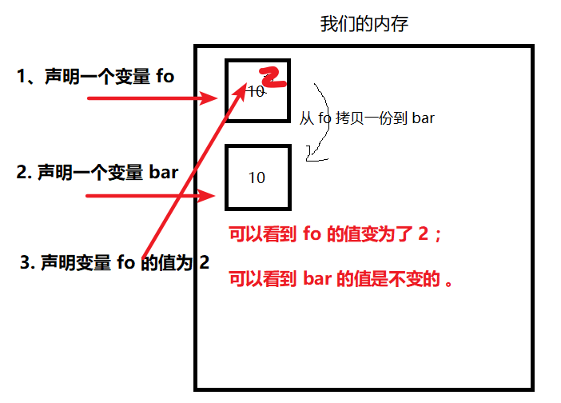

# 前端面试经常需要做一些 JavaScript 笔试题，其中包括很多关于执行结果、补充代码、编程类别的题目。

本课程就是为了帮应聘者解决这些常见问题的：

经常遇到的 JavaScript 题目；
解决执行结果、补充代码、编程题目的困惑和恐惧。
* 1. [part1_01 表达式计算](#part1_01)
	* 1.1. [1.原始表达式](#)
	* 1.2. [2.（数组、对象的）初始化表达式](#-1)
	* 1.3. [3.函数表达式](#-1)
	* 1.4. [4.属性访问表达式](#-1)
	* 1.5. [5.调用表达式](#-1)
	* 1.6. [6.对象创建表达式](#-1)
* 2. [part1_02 检测数据类型的方法](#part1_02)
	* 2.1. [数据类型分为以下两种 ：](#-1)
	* 2.2. [怎么检测数据类型呢 ？](#-1)
* 3. [part1_03 运算符优先级](#part1_03)
	* 3.1. [1. ++ -- 运算符](#-1)
	* 3.2. [2. + - 运算符](#-1)
	* 3.3. [3. + 加法运算符](#-1)
	* 3.4. [4. - 减法运算符](#-1)
	* 3.5. [5. * 乘法运算符](#-1)
	* 3.6. [6. / 除法运算符](#-1)
	* 3.7. [7. % 求模运算符](#-1)
	* 3.8. [8. == != 运算符](#-1)
	* 3.9. [9. < 小于、> 大于、<= 小于等于、 >= 大于等于](#-1)
	* 3.10. [10. 逻辑运算符](#-1)
	* 3.11. [11.&& 逻辑与](#-1)
	* 3.12. [12. || 逻辑或](#-1)
	* 3.13. [13. !  逻辑非](#-1)
	* 3.14. [14. 赋值运算符](#-1)
	* 3.15. [15. 条件运算符](#-1)
	* 3.16. [16.逗号运算符](#-1)
* 4. [ part2_01 基本数据类型和引用数据类型的区别](#part2_01)
	* 4.1. [1、栈(stack)和堆（heap）](#stackheap)
	* 4.2. [2、基本数据类型](#-1)
	* 4.3. [3、引用数据类型](#-1)
* 5. [part2_02 运算符，+NaN](#part2_02NaN)
	* 5.1. [一、 `+` 号](#-1)
	* 5.2. [二、 `-` 号](#-)
	* 5.3. [三、 `*` 号](#-1)
	* 5.4. [四、 `/` 号](#-1)
	* 5.5. [五、 逗号运算符 , 结果取逗号后面的](#-1)
	* 5.6. [六、 除了 `+` 运算符，其余的运算符`（- * / %）`运算时，如果符号两端是字符串，会先将字符串转为 `Number` 类型，再做数学运算](#-Number)
	* 5.7. [七、 `NaN` 跟任意数据类型运算 结果都是 `NaN`](#NaNNaN)
* 6. [part2_03 数据类型转换](#part2_03)
	* 6.1. [一、number](#number)
	* 6.2. [二、string](#string)
	* 6.3. [三、boolean](#boolean)
	* 6.4. [四、undefined](#undefined)
	* 6.5. [五、null](#null)
	* 6.6. [六、object](#object)
	* 6.7. [七、数据类型的转换](#-1)
	* 6.8. [划重点：](#-1)
* 7. [part3_01 变量声明前置](#part3_01)
	* 7.1. [下面的例子如果可以独立完成思考，你就理解了变量前置：](#-1)
	* 7.2. [为什么要了解并理解变量前置](#-1)
	* 7.3. [题目:](#:)
		* 7.3.1. [分析步骤：](#-1)
* 8. [part3_02 函数声明前置](#part3_02)
* 9. [part4_01 函数的声明方式](#part4_01)
	* 9.1. [定义函数的方式：](#-1)
	* 9.2. [函数声明如下代码所示：](#-1)
	* 9.3. [函数表达式：](#-1)
* 10. [part4_02 自执行函数](#part4_02)
	* 10.1. [立即执行函数是什么](#-1)
	* 10.2. [立即执行函数有什么作用](#-1)
* 11. [part4_03 提取查询参数](#part4_03)
* 12. [part5_01 补充代码 (补充面试题)](#part5_01)
	* 12.1. [1.](#-1)
* 13. [part5_02 字符串出现最多的字符](#part5_02)


##  1. <a name='part1_01'></a>part1_01 表达式计算

    表达式是 javascript 中的一个短语，javascript 解释器会将其计算出一个结果。程序中常用量是最简单的一类表达式就是变量。

    变量名也是一种简单的表达式，它的值就是赋值给变量的值。

    复杂的表达式是由简单的表达式组成的。比如数组访问表达式是由一个表示数组的表达式，方括号、一个整数表达式构成。它们所组成新的表达式运算结果是该数组特定位置的元素值。

    同样的函数调用表达式由一个表示函数对象的表达式和 0 个多个参数表达式构成。将简单表达式组成复杂表达式最常用的方法就是运算符。

    简单来讲，表达式就是由 变量、常量、运算符、函数返回值 组成的一段公式。

###  1.1. <a name=''></a>1.原始表达式

        原始表达式是表达式的最小单位——它不再包含其他表达式

直接量：

    数字直接量：一个数字直接出现在 JavaScript 程序中。  1.23
    字符串直接量--由单引号或者双引号括起来的字符序列。   'abc'
    正则表达式直接量--两条斜线之间的文本构成。          /pattern/

JavaScript 的一些保留字/关键字:

```javascript
    true
    false
    null
    this（和其他关键字不同，this并不是一个常量，它在程序中的不同地方返回的值也不相同。）
```

变量：

```javascript
i; //返回变量 i 的值
sum; //返回变量sum的值
```

###  1.2. <a name='-1'></a>2.（数组、对象的）初始化表达式

```javascript
var i = []; //空数组
var j = [1 + 2, 2 + 3]; //两个元素的数组
var x = [[1, 2], [3, 4], [5, 6]]; //嵌套数组
var y = [1, , , 2]; //中间两个元素undefined
var z = [1, 2]; //结尾逗号后的元素不会创建
```

    对象初始化表达式是由花括号开始，每个子表达式都包含一个属性名和一个冒号作为前缀：

```javascript
var i = {}; //空对象
var j = { a: 1, b: 2 }; //两个元素的对象
var x = { a: { x: 1, y: 2 }, b: { x: 1, y: 2 } }; //嵌套对象
```

###  1.3. <a name='-1'></a>3.函数表达式

```javascript
     var fn = function（）{}；
```

或者：

```javascript
    （ function（）{ console.log ("hello") }）()；
```

###  1.4. <a name='-1'></a>4.属性访问表达式

    - 运算得到一个对象属性或一个数组元素的值

```javascript
var obj = { x: 1 };
```

    - 我们可以通过  obj.x 或者 obj [" x "] 来访问它的属性，这一类表达式就称之为属性访问表达式。
    - 若计算结果是null或undefined，表达式会抛出一个类型错误异常，因为这两个值都不能包含任意属性
    - 若对象表达式后跟随一对方括号，则会计算方括号内的表达式的值并将其转换成字符串。不论什么情况，如果命名的属性不存在，则整个属性访问表达式的值为undefined

###  1.5. <a name='-1'></a>5.调用表达式

    - function（）；来调用一个函数，这样的表达式就称之为调用表达式。
    - 步骤：计算函数表达式--计算参数表达式--得到一组参数值---实参的值被依次赋值给形参，这些形参是定义函数时指定的--执行函数体（若函数使用return返回，返回值是整个调用表达式的值。否则表达式的值为undefined）
    - 如果表达式是一个属性访问表达式，则这个调用为“方法调用”
    - 方法调用中执行函数体，作为属性访问主题的对象和数组是其调用方法内this的指向。但是不是所有方法的调用表达式都使用全局对象作为this的值

###  1.6. <a name='-1'></a>6.对象创建表达式

    - 定义：创建一个对象并调用一个函数（这个函数是构造函数）初始化对象的属性。
    -对象创建表达式和函数调用类似，只在对象创建表达式前多一个new

```javascript
new Object();
new Point(2, 3);
```

    - 一个对象创建表达式不传任何参数给构造函数，空圆括号可以省略

```javascript
new Object();
new Date();
```

    - 例如：

    new Function（1,2）；我们可以传参，如果没有参数我们也可以new Object；创建一个空的对象这样也是合法的。
	
	
##  2. <a name='part1_02'></a>part1_02 检测数据类型的方法


**面试题中经常会考 js 数据类型检测，分享一下 js 中常用的几种方法来判断数据类型

###  2.1. <a name='-1'></a>数据类型分为以下两种 ：

1、基本数据类型

`String、 Number、 Boolean、 Symbol、 Undefined、 Null `

2、引用数据类型

`Object、 Function、 Array、 Date...`

基本类型也称为简单类型，指的是不同变量会分配不同的存储空间，为了便于提升变量查询速度，将其存储在栈中。

引用类型也称为复合类型，由于其值的大小会改变，将值存储在堆中。

###  2.2. <a name='-1'></a>怎么检测数据类型呢 ？

** 一、typeof   检测数据类型的运算符**

`console.log(typeof '');      //string`

`console.log(typeof 1);      //number`

`console.log(typeof Symbol());     //symbol`

`console.log(typeof true);      //boolean`
 
`console.log(typeof new Function());    //function`

`console.log(typeof undefined);     //undefined`

`console.log(typeof {});         //object`

`console.log(typeof null);     //object    无效`

`console.log(typeof []);         //object   无效`

`console.log(typeof new Date());         //object   无效`

`console.log(typeof new RegExp());         //object   无效`


通过以上输出结果，可以看到 ：

对于基本类型，除 null 以外，均可以返回正确的结果。

对于引用类型，除 function 以外，一律返回 object 类型。

对于 null ，返回 object 类型。

对于 function 返回  function 类型。

** 局限性 ：**

1、因为 null 值表示一个空对象指针，所以这也正是使用 typeof 操作符检测 null 值时会返回 "object" 的原因，其实 null 的数据类型是 Null ; 

1、引用类型中的 数组、日期、正则 也都有属于自己的具体类型 ; 而 typeof 对于这些类型的处理，只返回了处于其原型链最顶端的 Object 类型。


** 二、instanceof   检测某一个实例是否属于某个类 **


主要用来弥补 typeof 不能检测具体属于哪个对象的局限性。


`console.log("1" instanceof String);   //false`

`console.log(1 instanceof Number);   //false`

`console.log(true instanceof Boolean);   //false`

`console.log(null instanceof Object);   //false`

`console.log(undefined instanceof Object);  //false`

`console.log([] instanceof Array);  //true`

`console.log(function(){} instanceof Function);  //true`

`console.log({} instanceof Object);  //true`

**局限性：**

1、不能用于检测和处理字面量方式创建出来的基本数据类型值，即基本数据类型。

2、instanceof的特性：只要在当前实例的原型链上的对象，我们用其检测出来都为true。

** 三、Object.prototype.toString.call()　原型链上的Object对象的toString方法**

返回值的类型为string类型，是最全面也是最常用的检测数据类型的方式。


`Object.prototype.toString.call('') ;   // [object String]`

`Object.prototype.toString.call(1) ;    // [object Number]`

`Object.prototype.toString.call(true) ; // [object Boolean]`

`Object.prototype.toString.call(Symbol()) ; //[object Symbol]`

`Object.prototype.toString.call(undefined) ; // [object Undefined]`

`Object.prototype.toString.call(null) ; // [object Null]`

`Object.prototype.toString.call(new Function()) ; // [object Function]`

`Object.prototype.toString.call(new Date()) ; // [object Date]`

`Object.prototype.toString.call([]) ; // [object Array]`

`Object.prototype.toString.call(new RegExp()) ; // [object RegExp]`

`Object.prototype.toString.call(new Error()) ; // [object Error]`

##  3. <a name='part1_03'></a>part1_03 运算符优先级

`JavaScript` 中的运算符优先级是一套规则。该规则在计算表达式时控制运算符执行的顺序。具有较高优先级的运算符先于较低优先级的运算符执行。


JavaScript 中的运算符用于`算术表达式`、`比较表达式`、`逻辑表达式`、`赋值表达式`等。需要注意的是，大多数运算符都是由标点符号表示的，比如 `+` 和 `=` 。而另外一些运算符则是由关键字表示的，比如 `typeof` 和 `instanceof` ，关键字运算符和标点符号都是正规的运算符。

下表列出了 `JavaScript` 中所有的运算符，并按照运算符的优先级排序的，前面的运算符优先级要高于后面的运算符优先级，被空行分隔开来的运算符具有不同的优先级。


###  3.1. <a name='-1'></a>1. ++ -- 运算符

++ -- 递增递减运算符借鉴自 C 语言，它们分前置型和后置型，作用是改变一个变量的值。

例如：


###  3.2. <a name='-1'></a>2. + - 运算符

当 + - 作为一元运算符时，应用于数值，表示数值的正负。应用于非数值，先按 `Number()` 转型函数对这个值执行转换，再表示该值的正负。


`JavaScript` 定义了3个乘性运算符：**乘法**、**除法**和**求模**。这些运算符与 C
语言的相应运算符用途类似，只不过在操作数为非数值的情况下会执行自动的类型转换。

如果参与乘法
计算的某个操作数不是数值，后台会先使用 `Number()`；

转型函数将其转换为数值。也就是说，空字符串将被当作 `0`，布尔值 `true` 将被当作 1 。

###  3.3. <a name='-1'></a>3. + 加法运算符

如果两个运算符都是数值，执行常规的加法计算，然后根据下列规则返回结果：

如果有一个操作数是 `NaN`，则结果是 `NaN`；

如果是 `Infinity` 加 `Infinity`，则结果是 `Infinity`；

如果是 `-nfinity` 加 `Infinity`，则结果是 `Infinity`；

如果是 `Infinity` 加 `Infinity`，则结果是 `NaN`；

如果是 `+0` 加 `+0`，则结果是 `+0`；

如果是 `-0` 加 `-0`，则结果是 `-0`；

如果是 `+0` 加 `-0`，则结果是 `+0`;

如果有一个操作数不是数值，那么就要应用如下规则：

如果两个操作数都是字符串，则将第二个操作数与第一个操作数拼接起来；

如果只有一个操作数是字符串，则将另一个操作数转换为字符串，然后再将两个字符串拼接起来。

如果有一个操作数是对象、数值或布尔值，则调用它们的 `toString()` 方法取得相应的字符串值，然后再应用前面关于字符串的规则。对于 `undefined` 和 `null`，则分别调用 `String()` 函数并取得字符串 `undefined` 和 `null`。

如果是 `null` 加 `null`，则结果是 `0`;

如果是 `undefined` 加 `undefined`，则结果是 `NaN`;

###  3.4. <a name='-1'></a>4. - 减法运算符

如果两个运算符都是数值，执行常规的减法计算，然后根据下列规则返回结果：

如果有一个操作数是 `NaN`，则结果是 `NaN`；

如果是 `Infinity` 减 `Infinity`，则结果是 `NaN`；

如果是 `Infinity` 减 `Infinity`，则结果是 `NaN`；

如果是 `Infinity` 减 `Infinity`，则结果是 `Infinity`；

如果是 `Infinity` 减 `Infinity`，则结果是 `Infinity`；

如果是 `+0` 减 `+0`，则结果是 `+0`；

如果是 `+0` 减 `-0`，则结果是 `-0`；

如果是 `-0` 减 `-0`，则结果是 `+0`；

如果有一个操作数不是数值，那么就要应用如下规则：

如果有一个操作数是字符串、布尔值、`null` 或 `undefined`，则先在后台调用 `Number()` 函数将其转换为数值，然后再根据前面的规则执行减法计算。

如果转换的结果是 `NaN`，则减法的结果就是 `NaN`；

如果有一个操作数是对象，则调用对象的 `valueOf()` 方法以取得表示该对象的数值。

如果得到的值是 `NaN`，则减法的结果就是 `NaN`。

如果对象没有 `valueOf()` 方法，则调用其 `toString()` 方法并将得到的字符串转换为数值。

如果是 `null` 减 `null`，则结果是 `0`;

如果是 `undefined` 减 `undefined`，则结果是 `NaN` ;


###  3.5. <a name='-1'></a>5. * 乘法运算符

用于计算两个数值的乘积，在处理特殊值的情况下，乘法运算符遵循下列特殊的规则：

如果操作数都是数值，执行常规的乘法计算，即两个正数或两个负数相乘的结果还是正数，而如果只有一个操作数有符号，那么结果就是负数。

如果乘积超过了 `JavaScript` 数值的表示范围，则返回 `Infinity` 或 `-Infinity`；

如果有一个操作数是 `NaN`，则结果是 `NaN` ；

如果是 `Infinity` 与 `0` 相乘，则结果是 `NaN` ；

如果是 `Infinity` 与非 `0` 数值相乘，则结果是 `Infinity` 或 `-Infinity`，取决于有符号操作数的符号；

如果是 `Infinity` 与 `Infinity` 相乘，则结果是 `Infinity`；

如果有一个操作数不是数值，则在后台调用 `Number()`将其转换为数值，然后再应用上面的规则。

###  3.6. <a name='-1'></a>6. / 除法运算符

用于计算两个数值的商，与乘法运算符类似，除法运算符对特殊的值也有特殊的处理规则。

这些规则如下：

如果操作数都是数值，执行常规的除法计算，即两个正数或两个负数相除的结果还是正数，而如果只有一个操作数有符号，那么结果就是负数。

如果商超过了 `JavaScript` 数值的表示范围，则返回 `Infinity` 或 `-Infinity`；

如果有一个操作数是 `NaN`，则结果是 `NaN`；

如果是 `Infinity` 被 `Infinity` 除，则结果是 `NaN`；

如果是零被零除，则结果是 `NaN`；

如果是非零的有限数被零除，则结果是 `Infinity` 或 `-Infinity`，取决于有符号操作数的符号；

如果是 `Infinity` 被任何非零数值除，则结果是 `Infinity` 或 `-Infinity`，取决于有符号操作数的符号；

如果有一个操作数不是数值，则在后台调用 `Number()` 将其转换为数值，然后再应用上面的规则。

###  3.7. <a name='-1'></a>7. % 求模运算符

用于计算两个数值的余数，与另外两个乘性运算符类似，求模运算符会遵循下列特殊规则来处理特殊的值：

如果操作数都是数值，执行常规的除法计算，返回除得的余数；

如果被除数是无穷大值而除数是有限大的数值，则结果是 `NaN`；

如果被除数是有限大的数值而除数是零，则结果是 `NaN`；

如果是 `Infinity` 被 `Infinity` 除，则结果是 `NaN`；

如果被除数是有限大的数值而除数是无穷大的数值，则结果是被除数；

如果被除数是零，则结果是零；

如果有一个操作数不是数值，则在后台调用 `Number()` 将其转换为数值，然后再应用上面的规则。


###  3.8. <a name='-1'></a>8. == != 运算符

`==` `!=` 这两个运算符都会先转换操作数（通常称为强制转型），然后再比较它们的相等性。

在转换不同的数据类型时，相等和不相等运算符遵循下列基本规则：

如果有一个操作数是布尔值，则在比较相等性之前先将其转换为数值（`false` 转换为 0，而 true 转换为 1）；

如果一个操作数是字符串，另一个操作数是数值，在比较相等性之前先将字符串转换为数值；

如果一个操作数是对象，另一个操作数不是，则调用对象的 `valueOf()` 方法，用得到的基本类型值按照前面的规则进行比较；
`null` 和 `undefined` 是相等的。要比较相等性之前，不能将 `null` 和 `undefined` 转换成其他任何值。

如果有一个操作数是 `NaN`，则相等运算符返回 `false`，而不相等运算符返回 `true`。重要提示：即使两个操作数都是 `NaN`，相等运算符也返回 `false`；因为按照规则，`NaN` 不等于 `NaN`。

如果两个操作数都是对象，则比较它们是不是同一个对象。如果两个操作数都指向同一个对象，则相等运算符返回 `true`；否则，返回 `false`。


###  3.9. <a name='-1'></a>9. < 小于、> 大于、<= 小于等于、 >= 大于等于

这几个关系运算符用于对两个值进行比较返回一个布尔值。与 `JavaScript` 中的其他运算符一样，当关系运算符的操作数使用了非数值时，也要进行数据转换或完成某些奇怪的操作。以下就是相应的规则。

如果两个操作数都是数值，则执行数值比较。

如果两个操作数都是字符串，则比较两个字符串对应的字符编码值（可以通过字符串的 `charCodeAt()` 函数获取字符编码值）。

如果一个操作数是数值，则将另一个操作数转换为一个数值，然后执行数值比较。

如果一个操作数是对象，则调用这个对象的 `valueOf()` 方法，用得到的结果按照前面的规则执行比较。如果对象没有 `valueOf()` 方法，则调用 `toString()` 方法，并用得到的结果根据前面的规则执行比较。

如果一个操作数是布尔值，则先将其转换为数值，然后再执行比较。

###  3.10. <a name='-1'></a>10. 逻辑运算符

逻辑运算符是对操作数进行布尔算术运算，经常和关系运算符一起配合使用，逻辑运算符将多个关系表达式组合起来组成一个更复杂的表达式。

###  3.11. <a name='-1'></a>11.&& 逻辑与

逻辑与操作可以应用于任何类型的操作数，而不仅仅是布尔值。在有一个操作数不是布尔值的情况下，逻辑与操作不一定返回布尔值；此时，它遵循下列规则：

如果第一个操作数是对象，则返回第二个操作数；

如果第二个操作数是对象，则只有在第一个操作数的求值结果为 true 的情况下才会返回该对象；

如果两个操作数都是对象，则返回第二个操作数；

如果有一个操作数是 `null`，则返回 `null`；

如果有一个操作数是 `NaN`，则返回 `NaN`；

如果有一个操作数是 `undefined`，则返回 `undefined`。

逻辑与操作属于短路操作，即如果第一个操作数能够决定结果，那么就不会再对第二个操作数求值。对于逻辑与操作而言，如果第一个操作数是 `false`，无论第二个操作数是什么值，结果都不再可能是 `true` 了。

###  3.12. <a name='-1'></a>12. || 逻辑或
与逻辑与操作相似，如果有一个操作数不是布尔值，逻辑或也不一定返回布尔值；此时，它遵循下列规则：

如果第一个操作数是对象，则返回第一个操作数；

如果第一个操作数的求值结果为 `false`，则返回第二个操作数；

如果两个操作数都是对象，则返回第一个操作数；

如果两个操作数都是 `null`，则返回 `null`；

如果两个操作数都是 `NaN`，则返回 `NaN`；

如果两个操作数都是 `undefined`，则返回 `undefined` 。

与逻辑与运算符相似，逻辑或运算符也是短路运算符。也就是说，如果第一个操作数的求值结果为 `true`，就不会对第二个操作数求值了。

###  3.13. <a name='-1'></a>13. !  逻辑非

逻辑非操作可以应用于任何类型的操作数，无论这个值是什么数据类型，这个运算符都会返回一个布尔值。逻辑非运算符首先会将它的操作数转换为一个布尔值，然后再对其求反。逻辑非运算符遵循下列规则：

如果操作数是一个对象，返回 `false`；

如果操作数是一个空字符串，返回 `true`；

如果操作数是一个非空字符串，返回 `false`；

如果操作数是数值 `0` ，返回 `true`；

如果操作数是任意非 `0` 数值（包括 `Infinity`），返回 `false`；

如果操作数是 `null`，返回 `true`；

如果操作数是 `NaN`，返回 `true`；

如果操作数是 `undefined`，返回 `true`。

下面几个例子展示了应用上述规则的结果：


 逻辑非运算符也可以用于将一个值转换为与其对应的布尔值。而同时使用两个逻辑非运算符，实际上就会模拟 Boolean() 转型函数的行为。其中，第一个逻辑非操作会基于无论什么操作数返回一个布尔值，而第二个逻辑非操作则对该布尔值求反，于是就得到了这个值真正对应的布尔值。当然，最终结果与对这个值使用 Boolean() 函数相同，例如：


###  3.14. <a name='-1'></a>14. 赋值运算符

简单的赋值运算符由等于号 = 表示，其作用就是把右侧的值赋给左侧的变量，如下面的例子所示：


如果在等于号 = 前面再添加乘性运算符、加性运算符或位运算符，就可以完成复合赋值操作。这种复合赋值操作相当于是对下面常规表达式的简写形式：


 每个主要算术运算符（以及个别的其他运算符）都有对应的复合赋值运算符。这些运算符如下所示：

乘/赋值 `*=` ；

除/赋值 `/=` ；

模/赋值 `%=` ；

加/赋值 `+=` ；

减/赋值 `-=` ；

左移/赋值 `<<=` ；

有符号右移/赋值 `>>=` ；

无符号右移/赋值 `>>>=` 。

设计这些运算符的主要目的就是简化赋值操作，使用它们不会带来任何性能的提升。

###  3.15. <a name='-1'></a>15. 条件运算符
? : 条件运算符应该算是 `JavaScript` 中最灵活的一种运算符了，而且它遵循与 Java 中的条件运算符相同的语法形式，如下面的例子所示：


###  3.16. <a name='-1'></a>16.逗号运算符

逗号运算符多用于声明多个变量；但除此之外，逗号运算符还可以用于赋值。在用于赋值时，逗号运算符总会返回表达式中的最后一项，如下面的例子所示：


由于 `0` 是表达式中的最后一项，因此 `num` 的值就是 `0`。虽然逗号的这种使用方式并不常见，但这个例子可以帮我们理解逗号的这种行为。


优先级

1.算术运算符

2.比较运算符

3.逻辑运算符

4.赋值运算符  


以上就是我个人对 `javascript` 运算符优先级的一些理解，如有不足，还望评论指出


##  4. <a name='part2_01'></a> part2_01 基本数据类型和引用数据类型的区别

###  4.1. <a name='stackheap'></a>1、栈(stack)和堆（heap）
`Javascript` 包含两种不同类型的值：基本类型值 引用类型值；

>基本类型值：指的是保存在栈内存的简单数据段。

>引用类型值：指的是那些保存在堆内存的对象，意思是：变量中保存的实际上只是一个指针，这个指针指向内存堆中实际的值。

###  4.2. <a name='-1'></a>2、基本数据类型
5 种常用类型：`Number`、 `String`、 `Boolean`、 `Undefined`、 `Null` ，基本数据类型的值是按值访问的，就是说我们可以操作保存在变量中的实际的值

** 基本数据类型的赋值是简单赋值，是存放在栈内存里的**
```js
var fo = 10;
var bar = fo; // 将 fo 的值(10) 赋值给 bar ， bar  = 10 。
fo = 2;       // fo 的值声明为 2
console.log(fo, bar); //fo = 2 ,b = 10
```
图解：


从上面我们可以得知，当我改变fo中的数据时，bar中数据没有发生变化。

###  4.3. <a name='-1'></a>3、引用数据类型
** 引用数据类型：Object **

```js
var fo = {
	a: 10   
};
var bar = fo;  
fo.a = 2;  
console.log(fo.a, bar.a); //fo = 2 ,b = 2
```
图解：


从上面我们可以得知，当我改变fo中的数据时，bar中数据也发生了变化。当使用fo这个变量时，js解释器会通过bar存放的内存地址，找到内存中的相应地址，将其中的值取出来返回.


##  5. <a name='part2_02NaN'></a>part2_02 运算符，+NaN

###  5.1. <a name='-1'></a>一、 `+` 号

**任何值和字符串进行加法运算, 都会先转换为字符串之后再运算**

* `+` 号两侧都是数字类型   作用 ：求两个数字的和。

例：
```javascript
	var a = 11 + 5;
	console.log(a);          // 16
```
* `+` 号有一侧是字符串类型或者是引用值时 其作用都是字符串拼接。

例：
```javascript
	var b = 'sed' + 'abc';
	var c = 'dfsf' + 12;
	console.log(b);       // sedabc
	console.log(c);       // dfsf12
```	

###  5.2. <a name='-'></a>二、 `-` 号

* `-` 号两侧都是数字类型 作用 ：求两个数字的差

* 都是转换成数字类型在进行求两个数字的差

例：
```javascript
	var d = 20 - 8;
	console.log(d);          // 12
```
###  5.3. <a name='-1'></a>三、 `*` 号

* `*` 号两侧都是数字类型 作用 ：求两个数字的积

* 都是转换成数字类型在进行求两个数字的积

例：
```javascript
	var e = 3 * 5;
	console.log(e);           // 15
```
###  5.4. <a name='-1'></a>四、 `/` 号

* `/` 号两侧都是数字类型 作用 ：求两个数字的商

* 都是转换成数字类型在进行求两个数字的积

例：
```javascript
	var f = 10 / 2;
	console.log(f);           // 5
```
###  5.5. <a name='-1'></a>五、 逗号运算符 , 结果取逗号后面的

例1：
```javascript
	var g = (1,2);
	console.log(g);          // 2
```
例2：
```javascript
	var h = (false,true);
	var i = (true,false);
	console.log(h);       // true
	console.log(i);      // false
```
###  5.6. <a name='-Number'></a>六、 除了 `+` 运算符，其余的运算符`（- * / %）`运算时，如果符号两端是字符串，会先将字符串转为 `Number` 类型，再做数学运算

###  5.7. <a name='NaNNaN'></a>七、 `NaN` 跟任意数据类型运算 结果都是 `NaN`

* 如果一个字符串中含有除数字外的英文字母，做运算转化为 `Number` 类型时，字母无法转为数字，最终会得到 `NaN`


* NaN和 `+` 做运算，是字符串的拼接, `NaN` 和其余的算术运算符`（- * / %）`做运算，得到的都是 `NaN`

例1：
```javascript
	var j = 'sdfg' * 3;
	console.log(j);         // NaN
```
例2：
```javascript
	var str;
	var k = str + 3;
	console.log(k);         // NaN
```
例3：
```javascript
	var m = 100 / NaN;
	console.log(m);         // NaN
```
例4：
```javascript
	NaN+"11"     // "NaN11"
	NaN-11      // NaN
```
* `NaN` 和任何数据做关系运算，得到的都是 `false`

例：
```javascript
	NaN > 0     // false
```


##  6. <a name='part2_03'></a>part2_03 数据类型转换

**Js中的数据类型一共有六种，即number、string、boolean、undefined、null、object。**


###  6.1. <a name='number'></a>一、number

Number 数字类型，可以为整数，也可以是浮点数。

###  6.2. <a name='string'></a>二、string

字符串由零个或多个字符构成，需要注意的是
字符串必须放在引号里（单引号或双引号）。

###  6.3. <a name='boolean'></a>三、boolean

布尔类型        (`true`  `false`) 用来表示判断的结果

* 非零的数都表示 `true` , `0` 表示 `false`。

* 非 "" 空字符串表示 `true` , "" 空字符串表示 `false` 。

###  6.4. <a name='undefined'></a>四、undefined

指的是没有赋值的变量 （未定义）

###  6.5. <a name='null'></a>五、null

值为空(空对象)

###  6.6. <a name='object'></a>六、object

对象类型

* 常见的对象有 `array` 、`window` 、`document` 等。

###  6.7. <a name='-1'></a>七、数据类型的转换

**在 js 中我们经常需要知道某些变量的数据类型，并将其转换为我们所需要的数据类型。**

**数据的转换中，我们经常用到的是将变量转换成字符串或数字。**

* 转换成字符串要使用 `toString（）`。

* 转换成数字时，有两种方法，parseInt() 转换成整数，parseFloat() 转换成浮点数。

		例：
```javascript
			var test = parseInt(“blue”); 			// NaN
 
			var test = parseInt(“1234blue”); 	// 1234
 
			var test = parseInt(“22.5”);   // 22

			var test = parseFloat(“1234blue”); // 1234
 
			var test = parseFloat(“22.5”); // 22.5
```
* `NaN`  跟任意数据类型运算都是   `NaN` 。

* `undefined` 、`null` 、`NaN` 转为数字都是 `0` 。

* `undefined` 、`null` 、`NaN` 转为布尔值都是 `false` 。

###  6.8. <a name='-1'></a>划重点：
```javascript
 null == undefined  // true

 null == ''   //false

 null == null   //true

 !null    //true

 undefined == 0   //false

 undefined == ''   //false

 undefined == false  //false

 !undefined   //true

 false == ''  //true

 !false   //true

 false == false   //true

 !''   //true
```

**例：**
```javascript
	1. var a;    //undefined  未定义

	2. var b = a * 0;  //a 是 undefined, 转换为Number类型是NaN,结果 b 是 NaN

	3. if(b == b){    //false
		console.log(b*2+"2"-0+4);   //0*2+"2"-0+4
	  }else{
		console.log(!b*2+"2"-0+4); //!b 是 true, 所以：1*2+'2'-0+4=26
	  }
	  //注意：加的话只要有一边是字符串， 要把旁边的转换为字符串， 减乘除的一边不是数字也转为字符串。
```


##  7. <a name='part3_01'></a>part3_01 变量声明前置

我们先了解清楚 `Javascript` 工作方式：先解析代码，从上到下获取所有被声明的变量，然后再依次从上到下赋值

变量声明定义：变量声明前置就是在一个作用域块中，所有的变量都被放在块的开始出声明，通俗的讲：函数里面声明的变量，只是声明前置，而不会声明赋值，下面举几个例子你就明白了。


```js
alert(x);   //  undefined  变量声明前置
var x = 10; // 
```

>实际上是这个样子:

```js      
var x;     //注：声明被前置！实际是定义一个变量
alert(x);  // undefined  注：未定义的变量，所以输出了 undefined
x=10;   
```

>增加一行代码：

```js
alert(x);   //  undefined   注：变量声明前置
var x = 10; //   注：将10赋值给x
alert(x);   // 10 
```

>上面就清晰了，输出结果是 `undfined` 和 `10` ，我们再增加两行代码：

```js
alert(x);   
var x = 10; 
alert(x);  
x = 20;    
function x() {}  // 输出结果是多少呢？ 
```
>分析：首先js运行先进行解析代码，这里的变量 `var x` 会被前置；函数 `function x(){}` 也会被前置。

>小知识点：变量声明比函数声明置前。

>分析结果如下：

```js
var x；   // 变量前置
function x() {} // 函数前置，位置在变量后 
alert(x);   // function x(){}  注：输出整个函数
x = 10;    // 将10赋值给 x
alert(x);  // 10
x = 20;    
```

>最后让我们再增加一行代码，看看自己是否理解了声明前置!

```js
alert(x);   //function x(){}
var x = 10; 
alert(x);  10
x = 20;
function x() {}
alert(x);  //20
```


>再来一个例子：

```javascript
console.log(a, b); // 输出: undefined   fn b(){}
function b() {}
var a= 1;
console.log(a, b);  // 输出: undefined   fn b(){}
```


>为什么这样就会输出 `undefined` 和 `function b(){}` 呢？是因为在这个作用域执行的时候会进行变量声明前置。

```javascript
var a;   //声明被前置！实际是定义一个变量
function b() {} //定义一个方法 
console.log(a, b); // 输出: undefined   fn b(){}
a= 1; //给a赋值1
console.log(a, b);  // 输出: 1   fn b(){}
```

###  7.1. <a name='-1'></a>下面的例子如果可以独立完成思考，你就理解了变量前置：

```js
var a = 1;
function main() {
     console.log(a);
     var a = 2;
 }
main();
```

>调用这个函数，结果输出是 2 

>因为在这个里面，变量已经被前置了,解析结果：

```js
var a = 1;
function main() {
	 var a; //定义一个变量 a 
     console.log(a); // undefined 注：输出变量 a 
     a = 2;
 }
main();
```

###  7.2. <a name='-1'></a>为什么要了解并理解变量前置

 1.面试需要。
 
 2.自己写 `Javascript` 的时候就应该将声明放在作用域开始的地方，避免出现问题。
 
###  7.3. <a name=':'></a>题目:
###### 目的：加深记忆

```javascript
console.log(a); //undefined
console.log(b); //function b(){console.log(a)};
function b() {
	console.log(a); //undefined
}
b();
var a = 10;
console.log(a); //10
```

```javascript
var a=1;
function test(){
	console.log(a);
	var a=1;
}
test();
```

```javascript
var t=10;
function test(t){
	var t=t++;
	console.log(t); //10  注： t 按照从上自下顺序运行，先将自己赋值给 t，此时左面的 t 就是 10 ，所以输出的 t 就是10
}
test(t);
console.log(t); //10
```
难点题目：
```javascript
var t = 10;
fucntion test(test) {
	t = t + test;
	console.log(t);
	var t = 3;
}
test(t);
console.log(t);
```
我们分析下最后这个题目，首先是解析成如下结果：
```javascript
var t = 10;
fucntion test(test) {
	var t;
	t = t + test;
	console.log(t);
	t = 3;
}
test(t);  
console.log(t);
```
####  7.3.1. <a name='-1'></a>分析步骤：

> 1 . 首先调用了函数 `test` 代入 `t` ，此时 `t = 10` ，可以看做是：`function test(10){}`,
> 
> 2 . 往下走，`var t`，这是声明了一个变量 t ， 
> 
> 3 . 往下走，`t = t + test`; `t` 是 未定义 也就是 `undefined` ，`test` 是 `10` 。往后面执行的话，`undefined` 会转化成数字类型 `NaN` ，`NaN` 和任何数字相加，结果都是 `NaN` ,所以执行后 ： `t = NaN`
> 
> 4 .在最后的语句，需要输出 `t` ，全局的 `t = 10` ，输出就是 `10`
> 
> 5 .最后输出结果： `NaN` `10`

###### 要时时刻刻提醒自己，在js中变量要求声明后再使用。而且js是解释性语言，它的代码执行规律，自上向下执行的。


##  8. <a name='part3_02'></a>part3_02 函数声明前置

在变量声明前置中，我们也涉及到了函数声明前置，再举例几个例子带大家感受下声明前置。

>先让我们回顾下，直接上题目：
```javascript
var x = 1;
console.log(x+'——'+y);  // 1——undefined 注：var y 会前置
var y=2;
```

>这个是字符串拼接。

>下面进入我们的函数声明前置内容中：

```javascript
function setName(){
	name="张三";  // name 没有声明，说明是全局变量，相当于在 function 上方 有一个 var name；
}
setName();
console.log(name); // 张三
```

>知识点：
>
>没有使用 var 关键字的赋值语句变量  -> 为全局变量

```javascript
var b=2;
function test2(){
	window.b=3;
	console.log(b);  //3
}
test2();
```

>分析：
>
>window 是浏览器提供的全局对象，我们声明的全局变量 `b=2` 会挂载在 `window` 对象下，作为属性来存在。
>
>我们可以将 `window.b=3` 看成是 `b = 3` ；这样就好理解了，将 `3` 赋值 给 `b` 。
>
>输出结果：3

```javascript
c=5;
function test3(){
	window.c=3;  // 
	console.log(c);  //
	var c;   
	console.log(window.c); //
}
test3();
```

>我们先解析一下，解析后就非常清晰了

```javascript
var c=5;
function test3(){
	var c;     // 函数里面的变量前置 
	window.c=3;  // 
	console.log(c);  //  undefined   同名的 c 只是声明了 所以是 undefined
	console.log(window.c); // 3  注意：打印的是全局的 c 所以是 3
}
test3();
```

>再来一个最经典的函数声明前置的例子：

```javascript
console.log(a);
var a=3;
function a(){}
console.log(a);
```
> 如果自己算出了答案，可以和下面分析、结果对比下。

分析：

上来直接打印 `a` ，我们继续往下面看，首先 `var a` 会前置，再然后 `function a(){}` 也前置，位置在 `var a` 下面，最后位置如下：
```javascript
var a;
function a(){}
console.log(a);  // function a(){}
a=3;
console.log(a);  // 3
```

##  9. <a name='part4_01'></a>part4_01 函数的声明方式


###  9.1. <a name='-1'></a>定义函数的方式：

1.函数声明

2.函数表达式


###  9.2. <a name='-1'></a>函数声明如下代码所示：


关于函数声明，它最重要的一个特征就是函数声明提升，意思是执行代码之前先读取函数声明。这意味着可以把函数声明放在调用它的语句之后。如下代码可以正确执行：


###  9.3. <a name='-1'></a>函数表达式：

函数表达式有好几种不同的语法。最常见和最具代表性的一种如下代码所示：


这种形式看起来像是常规的变量赋值语句。但函数表达式和函数声明的区别是函数表达式在使用前必须先赋值。所以接下来看到的代码执行时会出错：


造成这种现象是因为解析器向执行环境加载数据时，解析器会优先读取函数声明，使其在执行代码前可用。而函数表达式，则必须等到解析器执行到它所在的代码区域，才会进行解析。


##  10. <a name='part4_02'></a>part4_02 自执行函数


  我们创建了一个匿名的函数 ，并立即执行它 ，由于外部无法引用它内部的变量 ，因此在执行完后很快就会被释放 ，关键是这种机制不会污染全局对象。
  
  自执行函数 ，即定义和调用合为一体 。
  
###  10.1. <a name='-1'></a>立即执行函数是什么

立即执行函数就是

1. 声明一个匿名函数
2. 马上调用这个匿名函数


**如下实例 ：**


首先声明一个匿名函数 `function (){ alert ('我是匿名函数')}` 。

然后在匿名函数后面接一对括号 `()` ，调用这个匿名函数 。

###  10.2. <a name='-1'></a>立即执行函数有什么作用
 
 1. 只有一个作用 ：创建一个独立的作用域 。

 2. 这个作用域里面的变量 , 外面访问不到（即避免「变量污染」）。
  
如下图 :


  

为什么 `alert` 的总是 `6` 呢，因为 `i` 是贯穿整个作用域的，而不是给每个 `li` 分配了一个 `i` 。

那么怎么解决这个问题呢？用立即执行函数给每个 `li` 创造一个独立作用域即可 。

如下图所示 ：


在立即执行函数执行的时候 ，`i` 的值被赋值给 `ii` ，此后 `ii` 的值一直不变 。

`i` 的值从 `0` 变化到 `5` ，对应 `6` 个立即执行函数 ，这 `6` 个立即执行函数里面的  `ii`  分别是      `0、1、2、3、4、5` 。

以上，就是立即执行函数的基本概念 。


##  11. <a name='part4_03'></a>part4_03 提取查询参数

**网址 URL ( `uniform` `resource` `location` ) 统一资源定位符** 

在 WEB 开发中，时常会用到 `Javascript` 来获取当前页面的 `url` 网址信息，在这里是我的一些获取 `url` 信息的小总结.

下面我举例一个 `URL` ，然后获得它的各个组成部分。

例：

http://www.xxxx.com/aaa.html#abc?a=1&b=2&c=&d=xxx

```
function getParameter(url) {
	var index = url.indexOf('?')	//查询参数 未找到返回-1
	var paraObj = {};

	if (index > -1) {
		var cxcs = url.substr(index + 1); //查询参数
		//var cxcs1=url.substring(index+1) //这里也可以使用 substring 方法

		var cxcsArray = cxcs.split('&'); //字符串转化成数组  输出得到 a=1,b=2,c=,d=xxx

		for (var i = 0, l = cxcsArray.length; i < l; i++) {
			
			var pa = cxcsArray[i].split('='); //在将字符串转化成数组 输出得到 a,1 b,2 c, d,xxx
			
			paraObj[pa[0]] = decodeURI(pa[1]);
		}
	}
	
	return paraObj;
}


alert(getParameter(url));

```

这样我们就能获取 `URL` 中的各个信息了。

当然还有其他的方法

**正则法**

```
function getParameter(name){
	var reg = new RegExp('(^|&)' + name + '=([^&]*)(&|$)', 'i');

	var r = window.location.search.substr(1).match(reg);

	if(r! = null){
		return unescape(r[2]);
	}

	return null;
}

alert(getParameter("参数名"));

```

**通过 `window.location` 属性来访问**


1、 `window.location.href` ( 设置或获取整个 URL 为字符串 )

```
var getParameter = window.location.href;
console.log(getParameter);

输出：http://www.xxxx.com/aaa.html#abc?a=1&b=2&c=&d=xxx

```

2、 `window.location.protocol` ( 设置或获取 URL 的协议部分 )

```
var getParameter = window.location.protocol;
console.log(getParameter);

输出：http:
```

3、 `window.location.host` ( 设置或获取 URL 的主机部分 )

```
var getParameter = window.location.host;
console.log(getParameter);

输出：www.xxxx.com

```

4、 `window.location.port` ( 设置或获取与 URL 关联的端口号码 )

```
var getParameter = window.location.port;
console.log(getParameter);

输出：空字符
( 如果采用默认的 80 端口( update :即使添加了: 80 )，那么返回值并不是默认的 80 而是空字符 )

```

5、 `window.location.pathname` ( 设置或获取与 URL 的路径部分（就是文件地址） )

```
var getParameter = window.location.pathname;
console.log(getParameter);

输出：aaa.html

```

6、 `window.location.search` ( 设置或获取 href 属性中跟在问号后面的部分 )

```
var getParameter = window.location.search;
console.log(getParameter);

输出：?a=1&b=2&c=&d=xxx

```

7、 `window.location.hash` ( 设置或获取 href 属性中在井号“#”后面的分段 )

```
var getParameter = window.location.hash;
console.log(getParameter);

输出：abc

```


##  12. <a name='part5_01'></a>part5_01 补充代码 (补充面试题)

**我们在日常面试中遇到过许多面试题，下面我就在来补充一些常见的面试题** 

###  12.1. <a name='-1'></a>1.

```javascript
var arr = []; //空数组
arr[0] = "a"; 
arr[1] = "b"; 
arr[10] = "c"; // 直接到下标为10的元素 中间默认补齐 为空
```

问题1：这个数组的 `length` 是多少？

问题2：`arr[5] = ???`

**问题分析：**

可以看到 一个空数组 依次往里边 赋值 

arr [0] 下标为 0 的元素 是 a

arr [1] 下标为 1 的元素 是 b 

arr [10] 下标为 10 的元素是 c

那输出 `arr` 数组 会得到

**["a","b",empty * 8,"c"]**	

**empty** 是空的意思，也就是 arr[1] 到 arr[10] 中间默认给补齐了，但是 是没有任何值的 所以

问题 1 的答案是 长度是 **11**

那么问题 2 就能解决了，arr[5] 是空的 访问一个不存在的元素，那输出结果肯定是 **undefined**


###2.

```javascript
console.log(a);
var a = 100;

function foo() {
    console.log(a);
    var a = 200;
    console.log(a);
}
foo();
console.log(a);
```

问题 都输出什么结果？

**问题分析：**

我们都知道 **变量** 有 **前置** 属性，**函数**也有 **前置** 属性， **变量前置** 优先于 **函数前置** 

前置是 **声明语句** 前置， **赋值不会前置**

所以上面的代码执行顺序是这样的

```javascript

var a;

console.log(a);

a = 100;

function foo(){
	
	var a;

	console.log(a);

	a = 200;

	console.log(a);

}

foo();

console.log(a);

```

所以输出的结果依次是：

**undefined**

**undefined**

**200**

**100**


###3.

```javascript

function test(){
	
	console.log(foo);
	console.log(bar);

	var foo="Hello";

	console.log(foo);

	var bar = function(){
		return "world";
	}

	function foo(){};

}

test();

```

问题 依次输出的结果？

**问题分析：**

还是上一题的 **前置** 问题

变量前置，函数内变量也前置

上述代码实际执行顺序是

```javascript

function test(){
	 var foo;
	 var bar;
	 function foo() {}

	 console.log(foo);
	 console.log(bar);

	 foo = 'Hello';
	 console.log(foo);

	 bar = function() {
	 	return 'world'; 
	 }
}

test();

```

所以输出的结果依次是：


**function(){}**

**undefined**

**Hello**


##  13. <a name='part5_02'></a>part5_02 字符串出现最多的字符

下面来做一个 统计字符串中出现最多的字符

例：'aaaaaaaasddddddddfssssaaaaassdsdsfsdgdsasdssssssddddaaaa'

```javascript

function getManyChar(star) {

	var obj = {}; //遍历出的字符 存到一个空的变量里

	for ( var i = 0, l = star.length; i < l; i++ ){  //遍历出字符串中的所有字符

	var perChar = star.charAt(i); //返回在指定位置的字符

	if (obj[perChar] == undefined) { //判断对象中有没有当前字符
		obj[perChar] = 1; //没有时 赋1
	} else {
		obj[perChar] = obj[perChar] + 1; //有  次数+1
		}
	}

	var maxKey = '' , max = 0 ;

	var maxkey1 = '';

	// maxKey 存出现最多的那个字符 空
	// max 存次数最多的值
	// maxKey2 存相同次数的数
	for (var attr in obj){

		if(obj[attr] > max){ //如果次数大于 max
			max = obj[attr]; //将次数这个数 赋给 max
			maxKey = attr; //存最多的那个字符 就等于这个字符
		}
		else if(obj[attr] == max){ //判断如果出现相同的数时

			max = obj [attr]; //相同数 最大值 还是 max

			maxKey1 = attr； //另一个次数相同的字符 存到 maxKey1 中 
		
		}

	}

	return {
		key :  maxKey + ',' + maxKey1,
		nums : max
	}

}

var star = 'aaaaaaaasddddddddfssssaaaaassdsdsfsdgdsasdssssssddddaaaa';

var res = getManyChar(star);

console.log(res);
```