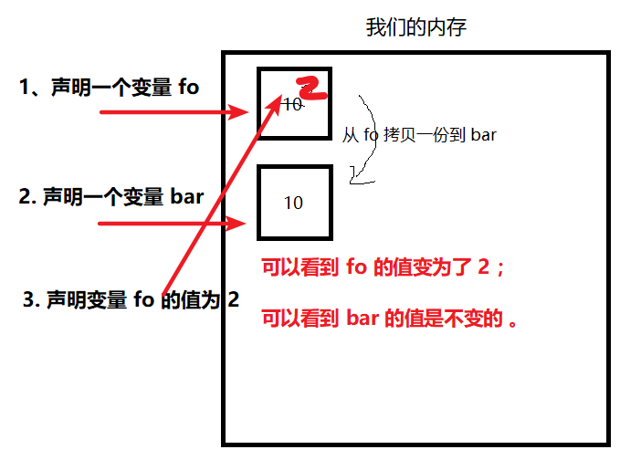

##  part2_01 基本数据类型和引用数据类型的区别

### 1、栈(stack)和堆（heap）
`Javascript` 包含两种不同类型的值：基本类型值 引用类型值；

>基本类型值：指的是保存在栈内存的简单数据段。

>引用类型值：指的是那些保存在堆内存的对象，意思是：变量中保存的实际上只是一个指针，这个指针指向内存堆中实际的值。

### 2、基本数据类型
5 种常用类型：`Number`、 `String`、 `Boolean`、 `Undefined`、 `Null` ，基本数据类型的值是按值访问的，就是说我们可以操作保存在变量中的实际的值

** 基本数据类型的赋值是简单赋值，是存放在栈内存里的**
```js
var fo = 10;
var bar = fo; // 将 fo 的值(10) 赋值给 bar ， bar  = 10 。
fo = 2;       // fo 的值声明为 2
console.log(fo, bar); //fo = 2 ,b = 10
```
图解：


从上面我们可以得知，当我改变fo中的数据时，bar中数据没有发生变化。

### 3、引用数据类型
** 引用数据类型：Object **

```js
var fo = {
	a: 10   
};
var bar = fo;  
fo.a = 2;  
console.log(fo.a, bar.a); //fo = 2 ,b = 2
```
图解：


从上面我们可以得知，当我改变fo中的数据时，bar中数据也发生了变化。当使用fo这个变量时，js解释器会通过bar存放的内存地址，找到内存中的相应地址，将其中的值取出来返回.